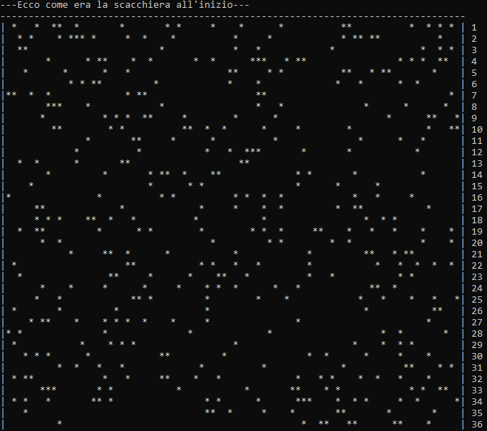
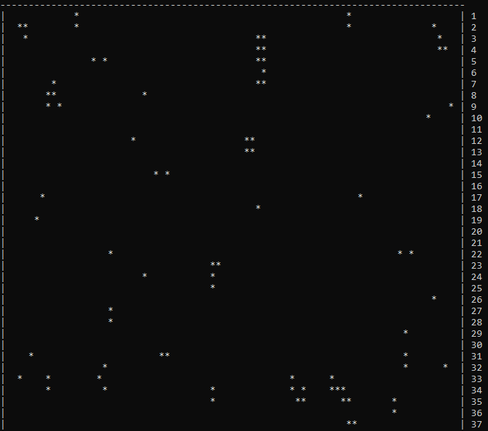
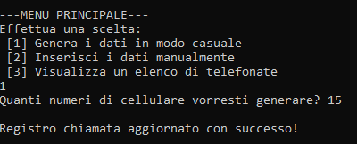
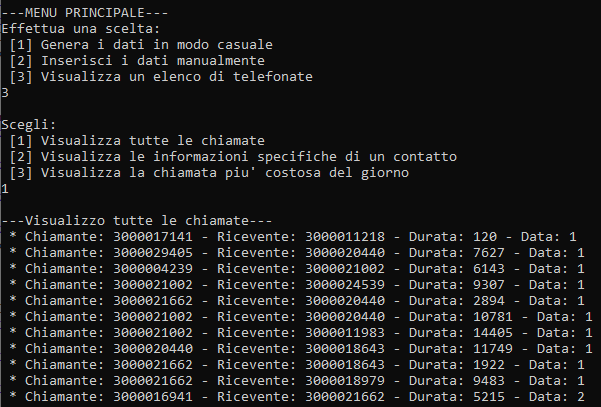

# 📱 Cell Simulation & Call Log Project

This project is a **simple Java-based simulation** designed for educational purposes.  
It models **cell state changes** over time and simulates **call log tracking**, with a very basic user interface for testing and visualization.

---

## 🎯 Overview
The goal of this project is to:
- Simulate **cell state transitions** step-by-step.
- Track and visualize **call logs** in a structured way.
- Provide **basic menu interfaces** for interacting with both simulations.

---

## 🛠 Features
- **Cell Simulation**:
  - Start from an initial cell state.
  - Advance through simulation steps.
  - Display changes visually.
- **Call Log Simulation**:
  - Record calls with time and status.
  - Display logs step-by-step.
- **Menu Navigation**:
  - Switch between simulation types.
  - View results for each scenario.

---

## 📸 Screenshots

### Cell Simulation Example
Initial State  
  
First Step  


---

### Call Log Example
First Call Entry  
  
Next Step  


---

### Menu Interface
  


---

## 🚀 How to Run
1. Clone the repository:
   ```bash
   git clone https://github.com/your-username/cell-call-simulation.git
